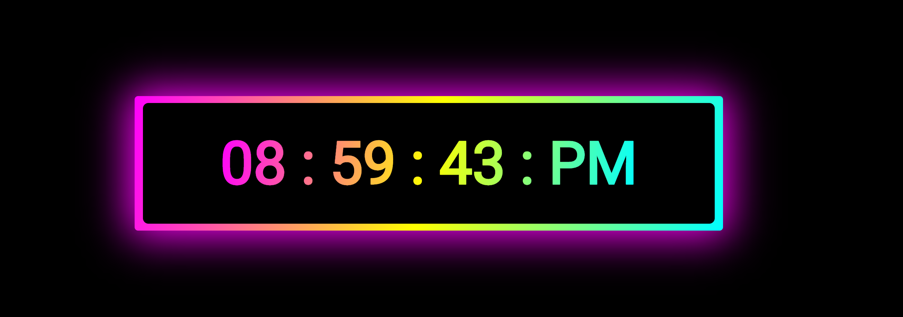

# Rolando Garcia Projects

These are my projects. I try to do complex projects to improve my skills as Flutter Developer.

Also here I'm not pretending to create the design with a specific architecture or with a dessign pattern.
My goal is to understand how the animations and complex designs interact with each other.

If you want to see how I implement the Clean Architecture or the MVVM you can see my profile in GitHub to explore all my projects on backend and mobile.

# WhatsApp

The chat's WhatsApp clone. Just with the animations and the native camera.

# Saver

A fancy menu design

# Credit

A fancy credit screen design

# Clock

A fancy clock

[Click here to watch it](https://rgprojects.netlify.app/#/clock)

# Author

Rolando Garcia from Mexico
